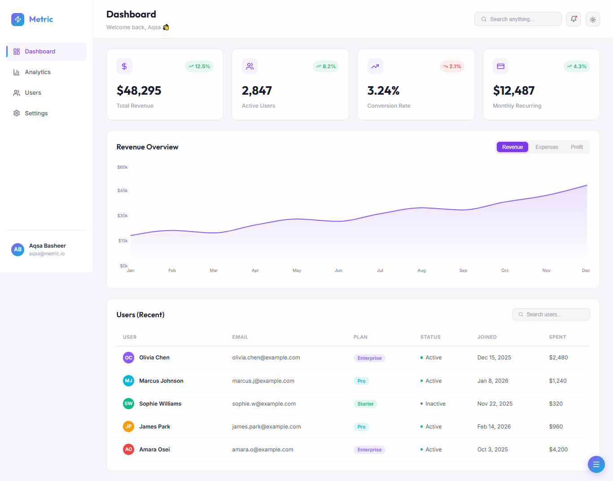

# Metric — SaaS Analytics Dashboard

<!-- 
📸 Add your screenshot here!
Take a screenshot of your dashboard, save it as `preview.png` in the `public/` folder, and uncomment the line below:
 
-->

A premium, modern SaaS analytics dashboard built with **React** and **Vite**. Features a polished, glassmorphic design, dark/light mode toggle, responsive layout, and beautiful data visualizations.

Currently set up as a **Frontend UI Template** populated with mock JSON data.

## ✨ Features

- **Dark & Light Mode:** Seamlessly switch themes with preferences saved to `localStorage`.
- **Responsive Design:** CSS Grid & Flexbox layout that gracefully collapses to a mobile-friendly bottom/hamburger navigation.
- **Data Visualizations:** Interactive, animated charts powered by [Recharts](https://recharts.org/).
- **Modern Tech Stack:** React 19, Vite, React Router v7, and Lucide Icons.
- **Glassmorphism:** Premium UI aesthetics with blurred backdrops, subtle gradients, and micro-animations.

## 🚀 Getting Started

### Prerequisites

Make sure you have [Node.js](https://nodejs.org/) installed on your machine.

### Installation

1. **Clone the repository:**
   ```bash
   git clone https://github.com/yourusername/saas-dashboard.git
   cd saas-dashboard
   ```

2. **Install dependencies:**
   ```bash
   npm install
   ```

3. **Run the development server:**
   ```bash
   npm run dev
   ```

4. **Open in browser:**
   Navigate to `http://localhost:5173/` to view the application.

## 📁 Project Structure

```
src/
├── components/       # Reusable UI components (Sidebar, TopBar, Charts, etc.)
├── context/          # React Context providers (ThemeContext)
├── data/             # Mock JSON data driving the dashboard
├── pages/            # Application routes/views (Dashboard, Analytics, Users, Settings)
├── App.jsx           # Main application shell and routing
├── App.css           # Global design system tokens and styles
└── main.jsx          # React entry point
```

## 🛠️ Built With

- [React](https://react.dev/)
- [Vite](https://vitejs.dev/)
- [React Router](https://reactrouter.com/)
- [Recharts](https://recharts.org/)
- [Lucide React](https://lucide.dev/)
- Pure CSS (No Tailwind overhead!)

## 📝 License

This project is open source and available under the [MIT License](LICENSE).
